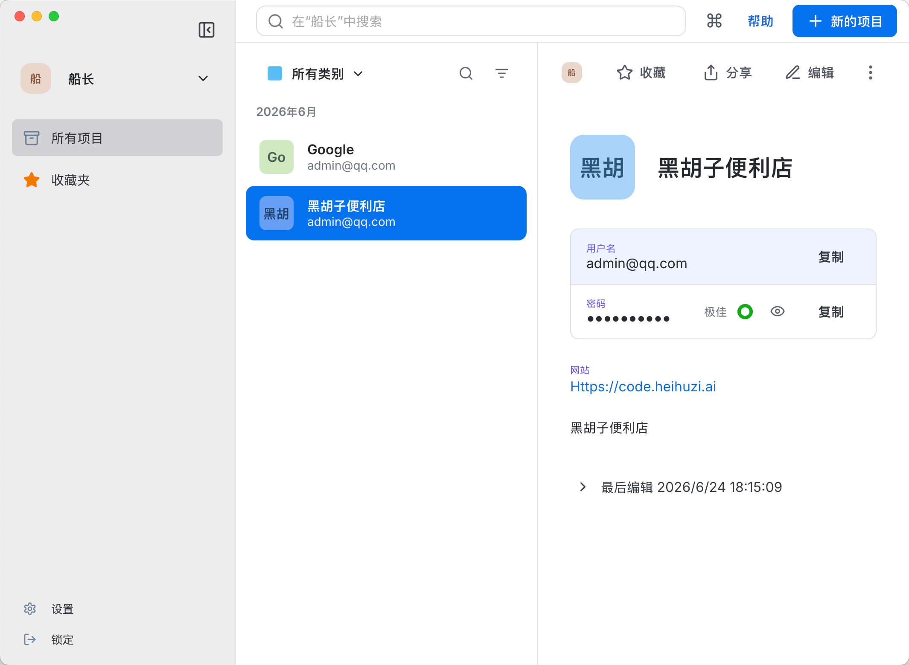
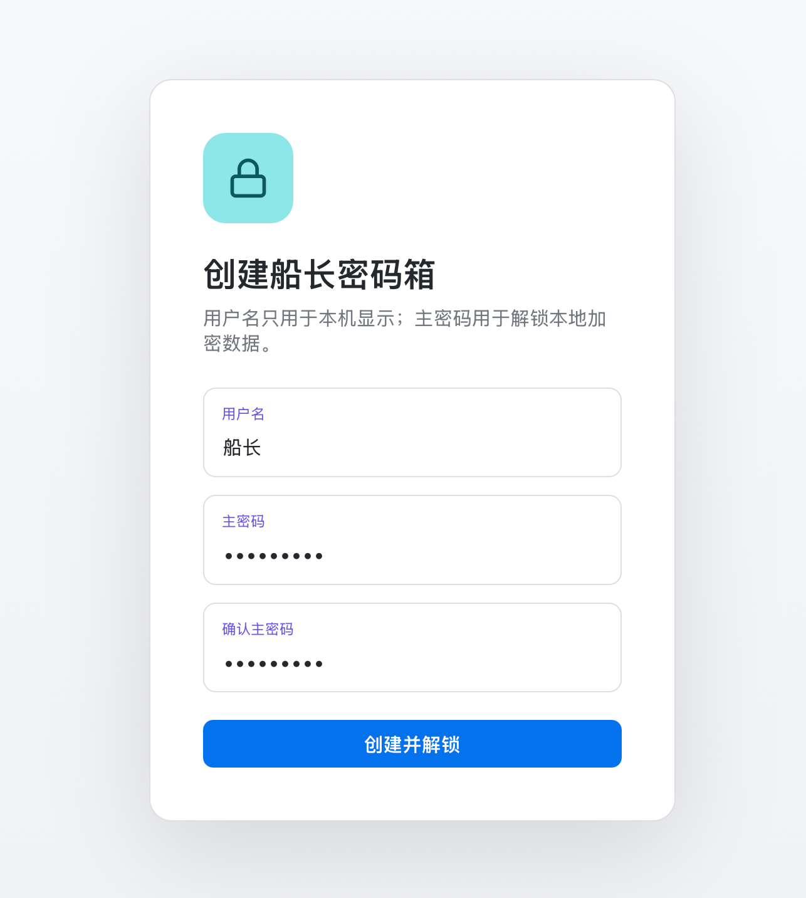
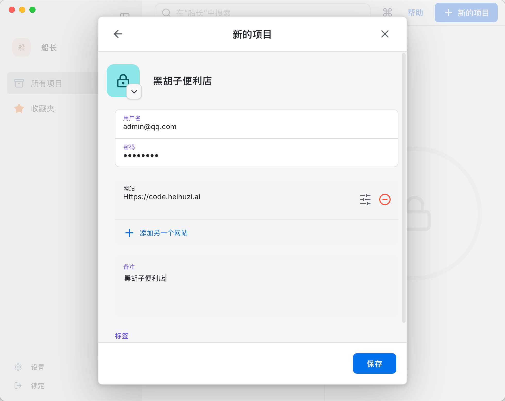
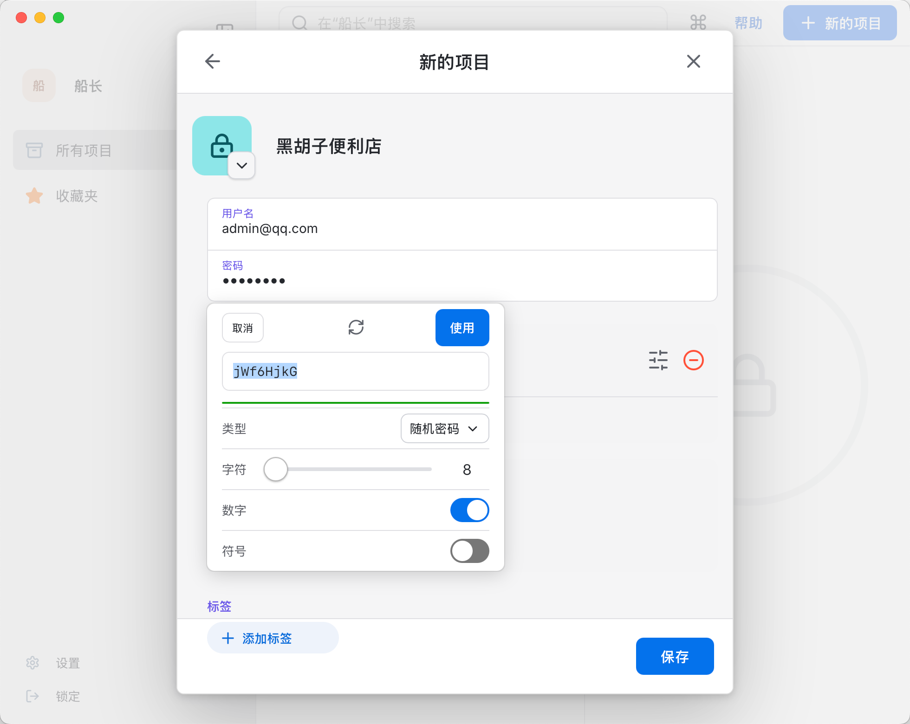
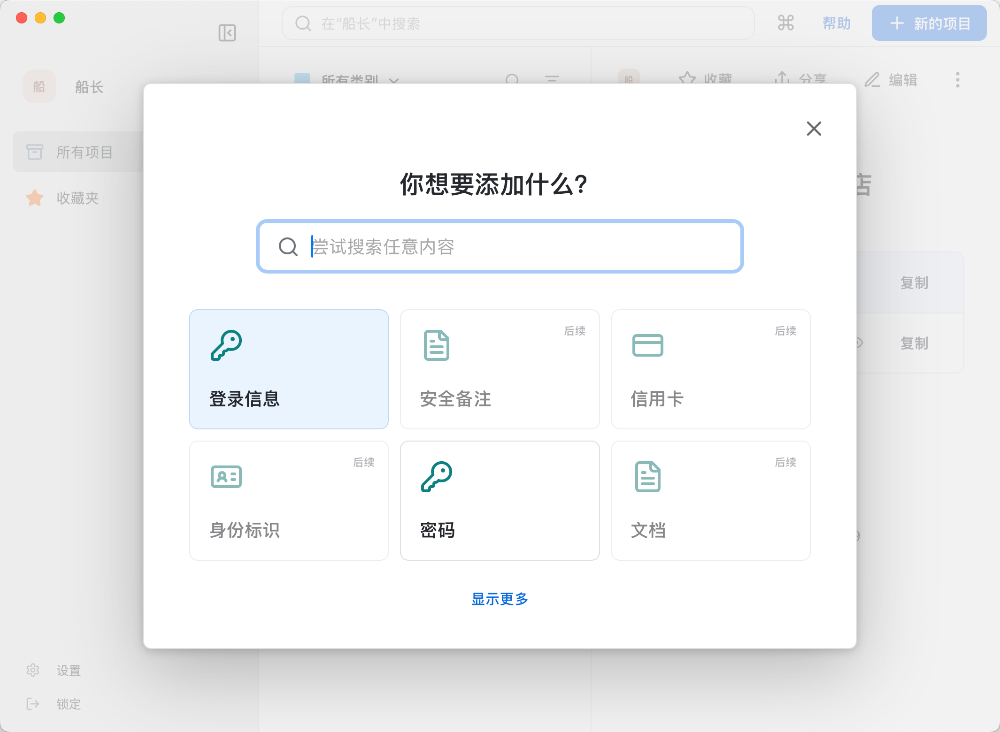
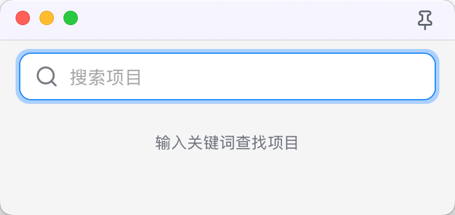
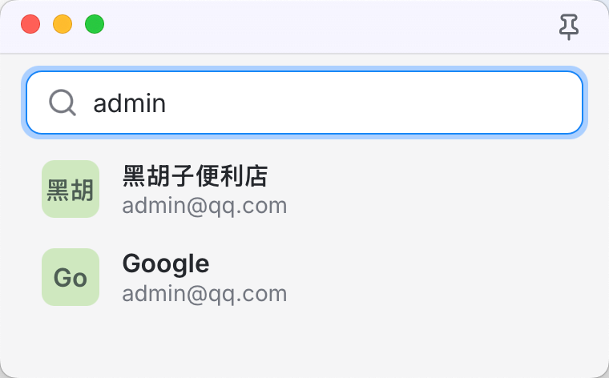
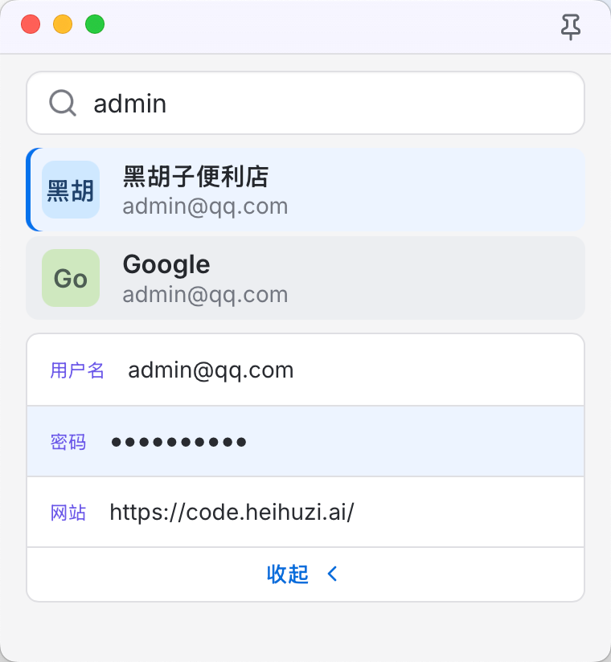

# 船长密码箱

<p align="center">
  
</p>

<h3 align="center">CaptainPassword</h3>

<p align="center">
  本地优先的桌面密码管理器。用主密码解锁本地保险库，管理登录信息、独立密码，并通过迷你查询窗口快速复制常用凭据。
</p>

<p align="center">
  <a href="https://github.com/heihuzicity-tech/CaptainPassword/releases"></a>
  
  
</p>



## 设计目标

船长密码箱不是云端密码服务，而是一个更轻、更直接的本地工具：

- **本地优先**：保险库数据保存在本机，使用主密码解锁后才在内存中展开密钥。
- **桌面原生体验**：基于 Tauri 构建，界面风格贴近 macOS 桌面应用。
- **快速复制**：不用在浏览器登录页和主窗口之间来回切换，可以用迷你查询窗口搜索并复制字段。
- **聚焦常用场景**：优先做好登录信息、独立密码、搜索、编辑、复制和密码生成。

## 功能特性

- 主密码解锁本地保险库。
- 登录信息管理：标题、用户名、密码、网站、备注、标签。
- 独立密码项目管理。
- 项目列表、收藏、搜索、分类筛选。
- 一键复制用户名、密码、网站等字段。
- 编辑模式支持网站字段增删、备注、标签和图标调整。
- 内置密码生成器，支持长度、数字、符号等选项。
- 迷你查询窗口支持关键字搜索、置顶、字段点击复制。

## 技术栈

- **Desktop shell**：Tauri 2
- **Frontend**：React 18、TypeScript、Vite
- **UI**：CSS Modules-style plain CSS、Lucide icons、Inter 字体
- **Backend**：Rust、Tauri commands
- **Storage**：SQLite、`rusqlite`
- **Encryption**：Argon2id 密钥派生、XChaCha20-Poly1305 加密、`zeroize` 清理内存密钥
- **Desktop integration**：系统剪贴板、全局快捷键、macOS overlay title bar
- **Automation**：GitHub Actions 多平台 CI / Release 构建

## 界面预览

### 首次创建与主界面

#### 创建本地保险库



#### 登录信息详情


### 编辑与创建

#### 编辑登录信息



#### 密码生成器



#### 新建项目



### 迷你查询窗口

#### 空状态



#### 搜索结果



#### 选中后复制字段



## 当前状态

当前版本优先支持两类项目：

- 登录信息
- 密码

新建入口中出现的安全备注、信用卡、身份标识、文档等类型属于后续扩展方向，界面已预留入口，但还不是当前版本的核心能力。

## 名称与包信息

- 中文产品名：`船长密码箱`
- 英文产品名：`CaptainPassword`
- GitHub 仓库名：`CaptainPassword`
- npm package / Rust crate：`captain-password`
- Bundle identifier：`ai.heihuzi.captainpassword`

Tauri 的 `productName` 保持 ASCII，是为了让 GitHub Release 产物在 macOS、Windows 上拥有稳定的文件名；用户看到的窗口标题仍然是 `船长密码箱`。

## 安全说明

船长密码箱采用本地优先设计，保险库数据保存在用户设备上，不依赖云端同步服务。主密码用于解锁本地保险库，敏感字段会以加密形式存储。

当前版本仍处于早期阶段，尚未经过第三方安全审计。正式保存高价值凭据前，建议先完成更多跨平台测试、备份策略、签名发布和安全审计。后续可以通过独立的 `SECURITY.md` 公开更完整的威胁模型、数据格式和安全设计。

## 开发

安装依赖：

```bash
npm ci
```

启动桌面开发版：

```bash
npm run tauri dev
```

前端构建：

```bash
npm run build
```

Rust 后端检查：

```bash
cargo check --locked --manifest-path src-tauri/Cargo.toml
```

本地打包：

```bash
npm run tauri -- build
```
